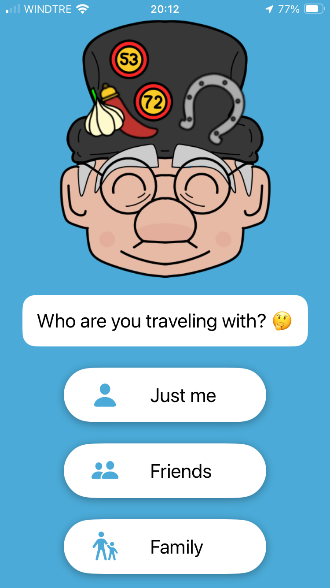
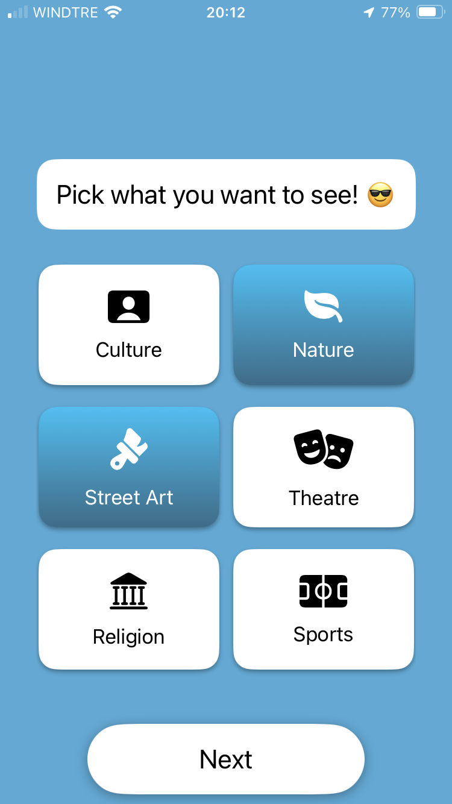
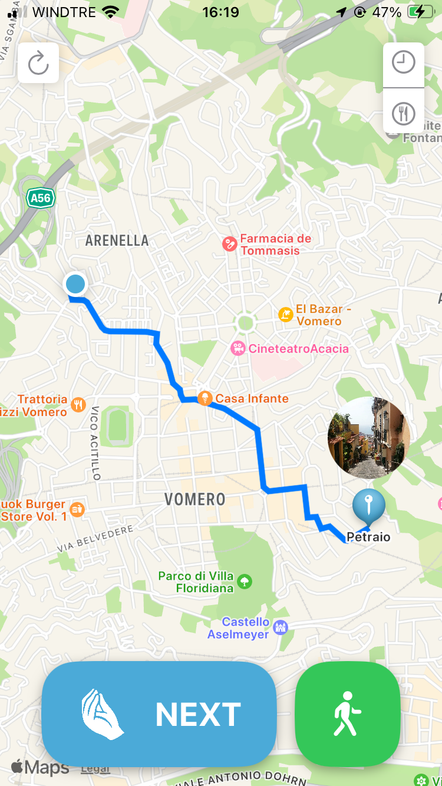
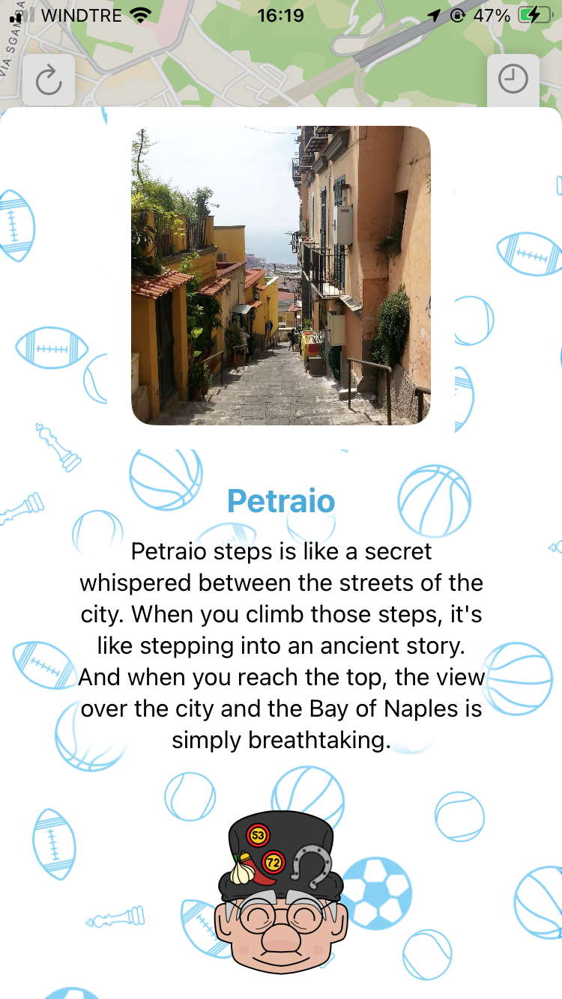
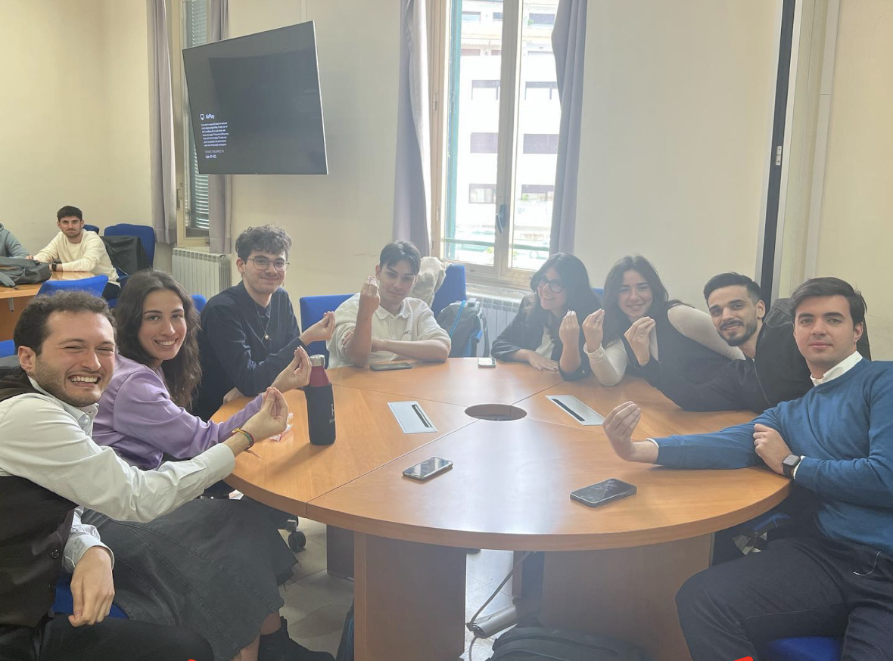

# AroJamm

This is the unofficial repository of AroJamm, an app that was developed during the Apple Foundation Standard Course in collaboration with University of Naples Parthenope.

The name of the app comes from the Neapolitan phrase "arò jamm," meaning "Where are we going?".
It's used both to ask for direction and to express confusion or uncertainty.

## Context

The app was presented along a [Keynote](https://www.dropbox.com/scl/fi/8caj6aa3zls5diu1zfvvk/Aro-Jamm.key?rlkey=beqjpwglj36o3olo8suw1g2xt&st=3b1c2q3h&dl=0) to Daryl Hawes, WWDR at Apple, Luigi d'Acunto, freelance collaborator with Apple and the Foundation Professors.

The presentation has also been exported to [PowerPoint](https://www.dropbox.com/scl/fi/oy135ae0ctfdfpitfu41p/Aro-Jamm.pptx?rlkey=flcpxpe3licoybo3hitnciv92&st=o8o436xp&dl=0) and [PDF](assets/AroJamm.pdf) formats.

You can also see a [small demo of the app](https://youtu.be/JB_lgBAjq5A).

## About

Aro Jamm is an app designed for turists visiting Naples. The first time you open it you are asked for your **preferences** regarding what to visit. There are 6 categories: Culture, Nature, Street Art, Theatre, Religion and Sports.

The app then allows you with a simple tap to check out the places near you that best fit your criteria. 
There are also postcards that can help you learn more about Naples' history and the place you will visit next.

## Technologies

The app was completely developed in Swift using the following frameworks:

* SwiftUI
* MapKit and CoreLocation

## Team

The app was created by a team of 8 people from various backgrounds:

| Name  |  Course | Role |
|---|---|---|
|  Simone Boscaglia  | Computer Science  | Coder & Pitcher |
|  Martina Cimafonte | Computer Science  | Coder |
|  Domenico Lugubre  | Computer Science  | Coder |
|  Orlando Pezone    | Computer Science  | UI/UX |
|  Christian Fabozzo | Computer Science  | Illustrations |
|  Valeria Pezone    | Engineering       | Locations Research |
|  Gabriele Palumbo  | Economics         | Locations Research |

We also received feedback from UI/UX tutors that helped us learn ways to make the app more accessible and straightforward to use.

