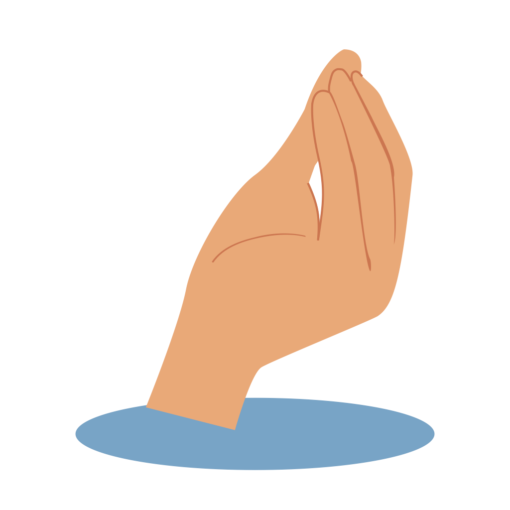
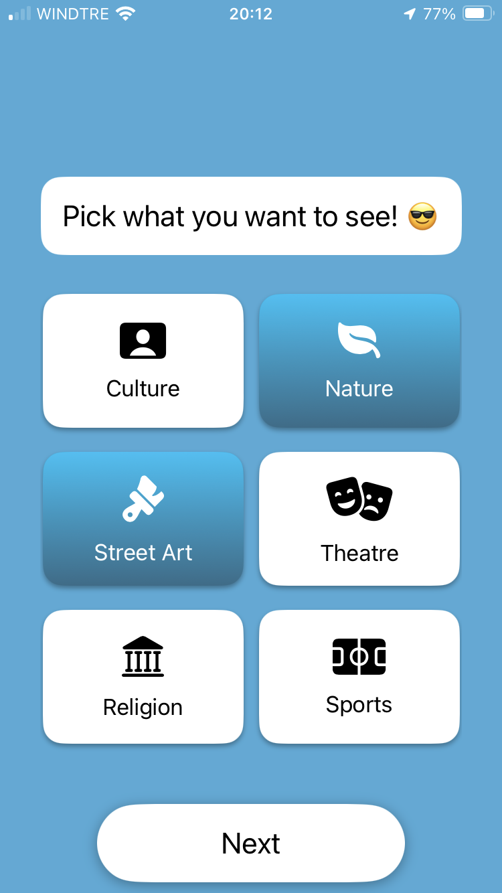
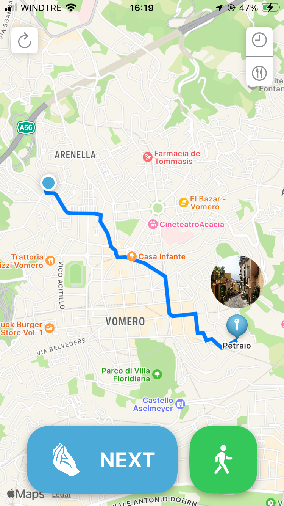
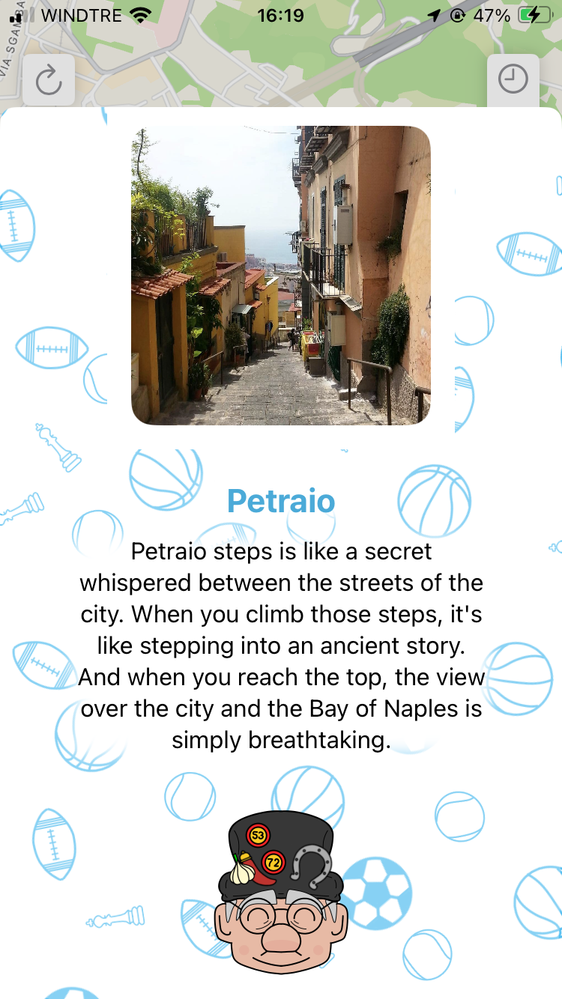
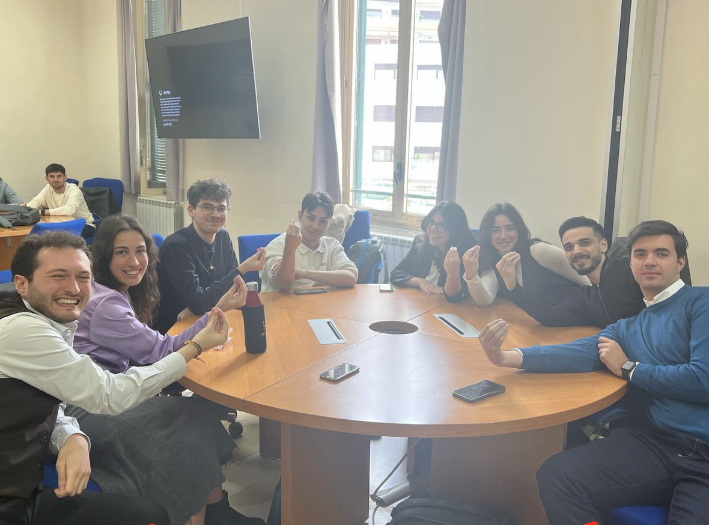

## AroJamm

 

**AroJamm** is a mobile app that helps tourists discover Naples through curated recommendations based on their interests. Designed for simplicity and cultural insight, AroJamm combines real-time location awareness with thematic filtering to suggest nearby landmarks and attractions.

> The name comes from the Neapolitan phrase *"arò jamm"*—meaning "Where are we going?"—used both to ask for direction and to express uncertainty.

## 📍 Project Context

- Developed during the **Apple Foundation Standard Course** in collaboration with **University of Naples Parthenope**
- Built in **about one week** by a cross-disciplinary team of students
- Presented to **Daryl Hawes (WWDR, Apple)**, **Luigi d’Acunto**, and course professors
- 🖥️ [Keynote](https://www.dropbox.com/scl/fi/8caj6aa3zls5diu1zfvvk/Aro-Jamm.key?rlkey=beqjpwglj36o3olo8suw1g2xt&st=3b1c2q3h&dl=0) | [PowerPoint](https://www.dropbox.com/scl/fi/oy135ae0ctfdfpitfu41p/Aro-Jamm.pptx?rlkey=flcpxpe3licoybo3hitnciv92&st=o8o436xp&dl=0) | [PDF](assets/AroJamm.pdf)
- 🎬 [Watch the demo](https://youtu.be/JB_lgBAjq5A)

## 🗺️ What It Does

AroJamm helps users:

- Select what they’re interested in: **Culture**, **Nature**, **Street Art**, **Theatre**, **Religion**, or **Sports**
- Instantly view and get directions to nearby places that match their preferences
- Read bite-sized, illustrated “postcards” about each place’s history and significance

## 📸 Screenshots

<table>
<tr>
<td></td>
<td></td>
<td></td>
<td></td>
</tr>
<tr>
<td>Let Gennarino help you</td>
<td>Pick what you like</td>
<td>Get Directions</td>
<td>Check Location Postcards</td>
</tr>
</table>

## 🔧 How It Works

The current filtering system is **static**: each location is manually tagged with one or more categories. When the user selects their interests, the app displays nearby places that match those fixed tags.

## 🧪 Technologies

The app was developed entirely in **Swift**, using:

| Framework      | Purpose  |
|---------|--------|
| `SwiftUI`       | UI layout |
| `MapKit`        | Map rendering and location display |
| `CoreLocation`  | User geolocation |

## 🧑‍💻 The Team

Developed by a multidisciplinary team of students from Computer Science, Engineering, and Economics.

| Name              | Background         | Role                  |
|------------|-----------|---------|
| Simone Boscaglia  | Computer Science   | Coder & Pitch Presenter |
| Martina Cimafonte | Computer Science   | Coder                  |
| Domenico Lugubre  | Computer Science   | Coder                  |
| Orlando Pezone    | Computer Science   | UI/UX Design           |
| Christian Fabozzo | Computer Science   | Illustration           |
| Valeria Pezone    | Engineering        | Location Research      |
| Gabriele Palumbo  | Economics          | Location Research      |

Thanks to the UI/UX tutors who supported accessibility and user testing efforts.

## 🚀 What’s Next?

Although AroJamm was a prototype built in one week, there are several potential directions to expand:

- Dynamic filtering based on time of day or context
- Integration of user feedback and ratings
- Support for multiple languages
- Gamification elements (e.g., collectible postcards, rewards)

## 📢 Contact

This repository is unofficial and provided for demo and educational purposes only.  
For feedback or collaboration, feel free to open an issue or reach out.
